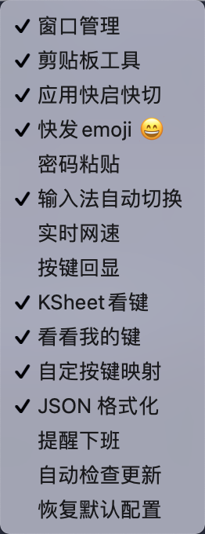
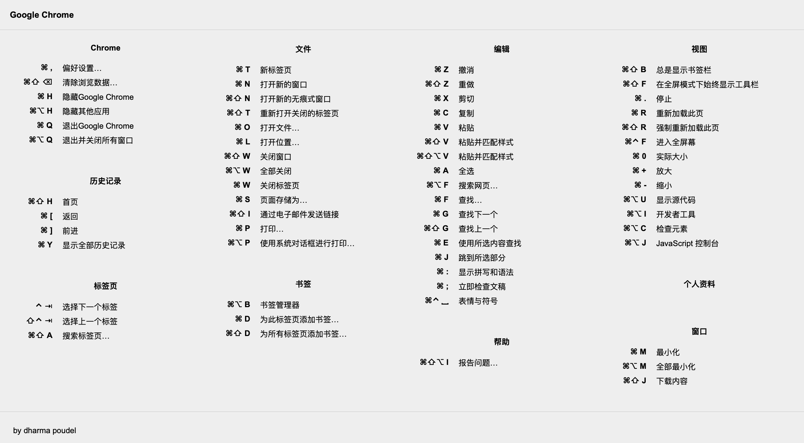
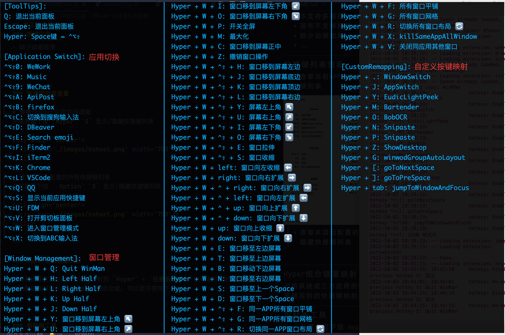
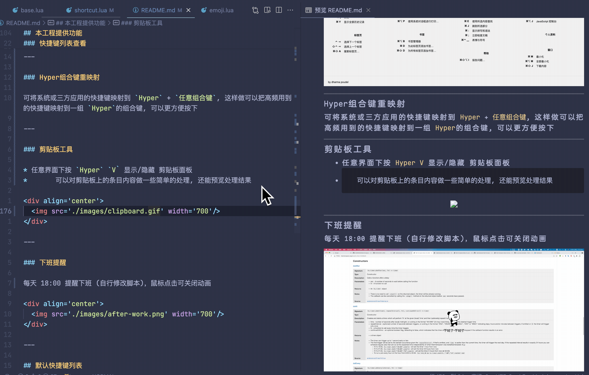

<div align='center'>
  
  
  
</div>

---
- 如果你觉得本项目提供的功能对你有用，请帮忙点一个 Star，不胜感激，谢谢！
- 若 README 图片无法显示，请确保挂了梯子，并且 PAC 文件中配置 `||githubusercontent.com`，或者直接使用全局模式

---

### 项目背景
之前长期使用的一款快捷键启动 APP [spacelauncher](https://spacelauncherapp.com/), 时不时弹窗提示"老兄用了这么久, 要不要考虑购买, 不买也说点什么吧", 然而它长期来没有新添加功能, 购买欲望不大, 于是想到用 **Hammerspoon** 来实现

---

### Hyper键理念
* 受到上述 `spacelauncher` 使用习惯的影响, 使用 `Space` + `字母键` 来启动/切换应用. 另外我有两个 `Space` 键(XDM, 了解下分裂式空格客制化键盘), 多余的空格键不利用太可惜了. 
* 如何实现 `Space` 作为 `Hyper` 键? 改键神器 [Karabiner-Elements](https://karabiner-elements.pqrs.org/) 申请出战. 添加如下配置到 `~/.config/karabiner/karabiner.json` 即可.
```json
{
    "description": "Change spacebar to HyperKey if pressed with other keys.",
    "manipulators": [
        {
            "from": {
                "key_code": "spacebar",
                "modifiers": {
                    "optional": [
                        "any"
                    ]
                }
            },
            "to": [
                {
                    "key_code": "right_shift",
                    "modifiers": [
                        "right_control",
                        "right_option"
                    ]
                }
            ],
            "to_if_alone": [
                {
                    "hold_down_milliseconds": 300,
                    "key_code": "spacebar"
                }
            ],
            "type": "basic"
        }
    ]
}
```

---

### TODO
1. 按键组, 序列键(HyperKey + W + M)
  * G[U, S], 打开指定网站 URL 或系统设置项
  * W[{HJKL}], 窗口快速调整大小与布局      ✅ 
2. 快捷启禁用
  * 指定的模块功能
  * 指定的配置文件, 根据 wifi 变更自动切换
3. 查询当前应用的菜单并模拟点击执行
4. 优化展示当前应用的所有快捷键 Sheet 
  * item 格式美化                       ✅
  * 查询
5. 显示HammerSpoon HS 定义的热键         ✅
6. 一组热键在不同的应用中有不同的作用
7. 剪贴板工具, 附加文本处理               ✅
8. 增强型PopClip, 按字母键触发
---

## 如何安装

本工程所有脚本都基于 Hammerspoon 运行，请先下载安装 [Hammerspoon](https://github.com/Hammerspoon/hammerspoon/releases)，然后再执行如下命令：

```shell
curl -fsSL https://raw.githubusercontent.com/boomker/spacehammer/main/install.sh | sh
```

如上面这条 `curl` 命令下载不了 `install.sh`，则请打开终端代理后重试或手动下载 `install.sh` 后执行

最后，Menubar 中点击 Hammerspoon `Reload Config` 按钮即可

---

## 手动更新

手动安装更新：

```shell
cd ~/.hammerspoon
git pull origin main
```

如果发现冲突，请解决冲突后再执行 `git pull origin main`

---

## 自动更新

除手动更新外，本工程还支持自动检查更新并安装，可在功能菜单中关闭自动更新.

自动更新原理如下：
- .config 文件（用户配置文件）加入到 .gitignore 文件中
- 定期执行 `git pull origin main`
- 如果发现冲突，则 console 打印自动更新失败相关提示信息，此时请手动安装更新，参考：[手动更新](https://github.com/boomker/spacehammer#%E6%89%8B%E5%8A%A8%E6%9B%B4%E6%96%B0)
- 如果发现默认配置版本号 > 用户本地 .config 文件的配置版本号，则在保留用户原有配置的基础上，将新增配置合并到用户本地 .config 文件中，并更新配置版本号

---

## 本工程提供功能
### 功能菜单

鼠标单击功能项，即可启用/禁用功能项

<div align='center'>
  
</div>

---

### 窗口管理

你可以丢掉大多数同类收费 App 了
<div align='center'>
  
</div>

---

### 应用切换

给指定的应用APP配置快捷键, 一键启动并前台聚焦
按下`Hyper` `Tab` 还能在当前桌面空间轮切应用窗口
(什么是 [工作空间?](https://support.apple.com/zh-cn/guide/mac-help/mh14112/mac))

---

### 表情包搜索

快捷键 `Hyper` `E` 唤醒表情包搜索功能，输入关键词，**上下**键用于选择、预览表情包；**左右**键用于翻页；**回车键**用于发送表情包；`Esc` 关闭搜索窗口

<div align='center'>
  
</div>

---

### 实时网速显示

实时显示网速(每两秒刷新一次)

<div align='center'>
  
</div>

---

### 密码粘贴

解决某些网站禁止粘贴密码、SSH 登陆需要手动输入密码等问题。
首先使用 `⌘` `C` 复制密码，然后在密码输入框内，按 `⌃` `⌘` `V` 即可将密码粘贴到输入框内。
原理为读取剪贴板最新一条记录，针对读取到的每一个字符，模拟按键事件。

---

### 输入法切换

默认分配了如下快捷键：

快捷键|功能
-|-
`Hyper` `C`|搜狗拼音输入法
`Hyper` `X`|ABC

以上快捷键是手动切换, 还可以配置在聚焦指定 APP 窗口后**自动切换**输入法(同类 APP 可以丢掉了)
TODO:
 * Bugfix: 在使用快捷键切换 space 时可能会无法自动切换输入法

---

### 按键回显

<div align='center'>
  
</div>

注：目前暂且实现了简单的按键回显，和 KeyCastr 相比在功能上仍相差甚远，如：
- 不支持多画布
- 画布不支持拖拽
- 缺少动画效果
- ...

---

### 快捷键列表查看

* 查看当前APP应用的快捷键
任意界面下按 `Hyper` `S` 显示/隐藏快捷键列表

<div align='center'>
  
</div>

* 查看本项目配置的所有快捷键列表
任意界面下按 ` Option` `S` 显示/隐藏快捷键列表

<div align='center'>
  
</div>

---

### Hyper组合键重映射

可将系统或三方应用的快捷键映射到 `Hyper` + `任意组合键`, 这样做可以把高频用到的快捷键映射到一组 `Hyper`的组合键, 可以更方便按下

---

### 剪贴板工具 

* 任意界面下按 `Hyper` `V` 显示/隐藏 剪贴板面板 
*     可以对剪贴板上的条目内容做一些简单的处理, 还能预览处理结果

<div align='center'>
  
</div>

---

### JSON 格式化转换工具 

* 任意界面下按 `Hyper` `T` 显示/隐藏 JSON 格式化窗口

 <div align='center'>
  
</div>

---

### 下班提醒

每天 18:00 提醒下班 (自行修改脚本)，鼠标点击可关闭动画

<div align='center'>
  
</div>

---

## 默认快捷键列表
### 应用启动

快捷键|功能
-|-
`Hyper` `.` |在同一应用的多个窗口之间切换
`Hyper` `Tab` |在不同应用之间的多个窗口切换
`Hyper` `J` |切换到上次激活的应用窗口
`Hyper` `Q` |打开 QQ
`Hyper` `8` |打开 网易云音乐 
`Hyper` `9` |打开 微信
`Hyper` `0` |打开 企业微信
`Hyper` `L` |打开 Visual Studio Code
`Hyper` `F` |打开 Path Finder
`Hyper` `K` |打开 Chrome
`Hyper` `B` |打开 Firefo 
`Hyper` `A` |打开 ApiPost
`Hyper` `D` |打开 Dbeaver 
`Hyper` `U` |打开 FDM 
`Hyper` `I` |打开 iTerm2

---

### 窗口管理 
快捷键|功能
-|-
`Hyper` `W` `H`|左半屏
`Hyper` `W` `L`|右半屏
`Hyper` `W` `K`|上半屏
`Hyper` `W` `J`|下半屏
`Hyper` `W` `Y`|左上角
`Hyper` `W` `U`|右上角
`Hyper` `W` `I`|左下角
`Hyper` `W` `O`|右下角
`Hyper` `W` `C`|居中
`Hyper` `W` `M︎`|最大化
`Hyper` `W` `P`|全屏
`Hyper` `W` `Z`|撤销上次窗口操作
`Hyper` `W` `E`|将窗口移动到左侧屏幕
`Hyper` `W` `N`|将窗口移动到右侧屏幕
`Hyper` `W` `T`|将窗口移动到上方屏幕
`Hyper` `W` `B`|将窗口移动到下方屏幕
`Hyper` `W` `S`|将窗口移动到上一个 Space
`Hyper` `W` `D`|将窗口移动到下一个 Space
`Hyper` `W` `⌃` `⇧` `E`|扩展窗口尺寸
`Hyper` `W` `⌃` `⇧` `S`|收缩窗口尺寸
`Hyper` `W` `⌃` `⇧` `H`|窗口移靠屏幕左边缘
`Hyper` `W` `⌃` `⇧` `L`|窗口移靠屏幕右边缘
`Hyper` `W` `⌃` `⇧` `J`|窗口移靠屏幕上边缘
`Hyper` `W` `⌃` `⇧` `K`|窗口移靠屏幕下边缘
`Hyper` `W` `⌃` `⇧` `Y`|窗口大小1/4屏幕并移靠屏幕左上角
`Hyper` `W` `⌃` `⇧` `U`|窗口大小1/4屏幕并移靠屏幕右上角
`Hyper` `W` `⌃` `⇧` `I`|窗口大小1/4屏幕并移靠屏幕左下角
`Hyper` `W` `⌃` `⇧` `O`|窗口大小1/4屏幕并移靠屏幕右下角
`Hyper` `W` `⌃` `⇧` `G`|同一应用的所有窗口自动网格式布局
`Hyper` `W` `⌃` `⇧` `F`|同一应用的所有窗口自动水平均分或垂直均分
`Hyper` `W` `⌃` `⇧` `R`|轮切同一应用的所有窗口水平或垂直均分布局
`Hyper` `W` `X`|关闭同一应用所有窗口
`Hyper` `W` `V`|关闭除当前窗口外 同一应用的其他窗口
`Hyper` `W` `G`|同一工作空间下的所有窗口自动网格式布局
`Hyper` `W` `F`|同一工作空间下的所有窗口自动水平均分或垂直均分
`Hyper` `W` `R`|轮切同一工作空间下的所有窗口水平或垂直均分布局

---

### 剪贴板工具
快捷键|功能
-|-
`Hyper` `V`|剪贴板面板开关键
`Q`|quit, 退出
`Return`|回车确认键直接粘贴到当前应用
`S`|保存会话, 多次保存会覆盖之前的
`R`|恢复上次保存的会话(剪贴板第一条内容)
`G`|默认浏览器中使用 Google搜索或 打开链接
`H`|在 Github 中搜索
`D`|保存剪贴板里的内容到桌面
`N`|使用 neovide 打开
`V`|使用 VSCode 打开
`B`|Base64 解码
`⇧` `B`|Base64 编码
`U`|URL 解码
`⇧` `U`|URL 编码
`M`|计算 MD5 值
`⇧` `M`|Markdown 转 HTML
`T`|去除字符串两边的多余空格和换行

---

### 重映射组合键
快捷键|功能
-|-
`Hyper` `Y` |EudicLightPeek 翻译单词
`Hyper` `M` |Bartender 搜索应用图标并模拟点击
`Hyper` `O` |BobOCR 图片文字识别
`Hyper` `N` |Snipaste 截图
`Hyper` `P` |Snipaste 贴图
`Hyper` `Z` |显示桌面
`Hyper` `[` |跳到下一个桌面空间
`Hyper` `]` |跳到上一个桌面空间
`⌃` `⌘` `⌥` `,` |跳到第一个桌面空间

---

### 其他功能模块快捷键
快捷键|功能
-|-
`Hyper` `S` |显示/隐藏当前应用快捷键列表面板
`Hyper` `C` |手动切换到中文输入法
`Hyper` `X` |手动切换到英文输入法
`Hyper` `E` |Emoji 搜索开关键
`Hyper` `T` |JSON 格式化转换窗口开关键
`⌃` `⌘` `V` |密码粘贴快捷键
<!-- `⌥` `/` |显示/隐藏快捷键列表 -->

---

## 关于
### 关于应用 bundle id

应用的 BundleId，可通过如下方式拿到：
```shell
osascript -e 'id of app "Name of App"'
```
当然你可以直接使用应用的名称, 注意不是**中文**的

---

### 关于工程目录结构

```shell
.hammerspoon
├── .config 用户本地配置文件，保存了用户每个功能模块的启用/禁用状态
├── .emoji 表情包缓存目录
├── .git
├── .gitignore
├── LICENSE
├── README.md
├── images 功能模块及 README 需要用到的图片
├── install.sh 一键拉取本工程脚本(需要提前安装 Git)
├── init.lua 脚本入口
└── modules 各个功能模块
    ├── application.lua 应用切换模块
    ├── base.lua 封装了 Lua 基本工具
    ├── config.lua 菜单默认配置，记录了每一项功能的默认启用/禁用状态
    ├── clipboardtool.lua 剪贴板模块
    ├── emoji.lua 表情包搜索模块
    ├── hotkey.lua 快捷键列表查看模块
    ├── input-method.lua 输入法切换
    ├── jsonFormat.lua json 格式化转换模块 
    ├── keystroke-visualizer.lua 按键回显模块
    ├── ksheet.lua 显示当前应用所有快捷键模块
    ├── menu.lua 菜单模块
    ├── network.lua 实时网速模块
    ├── password.lua 密码粘贴模块
    ├── reload.lua 重载配置模块
    ├── remind.lua 下班提醒模块
    ├── shortcut.lua 用户自定义快捷键
    ├── shortcut.lua.example 快捷键配置文件示例, 用户请勿修改此文件
    ├── shortcut-window.lua 窗口管理快捷键备份文件
    ├── update.lua 自动更新模块
    ├── window.lua 快捷键调用窗口管理功能模块
    └── winman.lua 窗口管理模块(具体实现)
└── Spoons HammerSpoon 官方功能模块
    ├── ClipShow.spoon 剪贴板模块
    ├── kSheet.spoon 查看当前应用快捷键 
    ├── ModalMgr.spoon 模态管理模块(可实现按键组)
    └── WinMan.spoon 窗口管理模块(原为WinWin, 二改版)
``` 

### 关于按键冲突 HS(Hammerspoon) Console 报错
当在 HS 控制台看到的报错类似如下:
> ERROR:   LuaSkin: This hotkey is already registered. It may be a duplicate in your Hammerspoon config, or it may be registered by macOS. See System Preferences->Keyboard->Shortcuts

这种情况是 多半是和你的 台前调度 快捷键(或其他快捷键)**冲突**了

---

## 参考与感谢

- [KURANADO2](https://github.com/KURANADO2/hammerspoon-kuranado)
- [zuorn](https://github.com/zuorn/hammerspoon_config)
- [sugood](https://github.com/sugood/hammerspoon)
- [官方 Quick Start](https://www.hammerspoon.org/go/)
- [官方文档](http://www.hammerspoon.org/docs/)
- [hammerspoon-init](https://github.com/rtoshiro/hammerspoon-init)